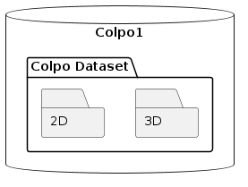

# Database Architecture

The dataset this project is based on is on the external SSD named `Colpo1`. It contains the folder `Colpo Dataset` that we will consider the root of the dataset.

The dataset in organied this way :

We will work separately on the 2D and 3D data because they have very different structures. 

## 2D

The 2D data is organized in the following way :

Each patient has a folder named `Patient_XXX` where XXX is the patient number. Inside each folder, 3 files represent 3 images of the same patient taken with different *contrast mediators*. The images are named after them : `acetic_acid.jpg`, `lugol.jpg` and `saline.jpg`. 

## 3D 

TO DO
