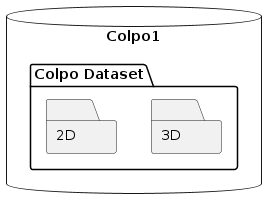
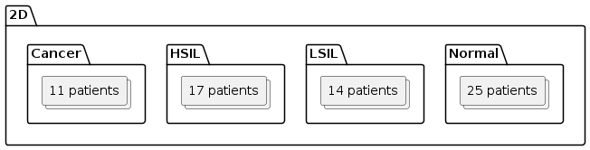
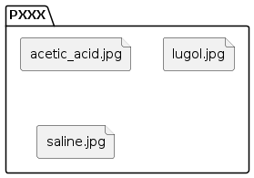
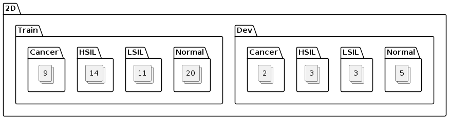

# Dataset Architecture

The dataset this project is based on is on the external SSD named `Colpo1`. It contains the folder `Colpo Dataset` that we will consider the root of the dataset.

The dataset in organied this way :

We will work separately on the 2D and 3D data because they have very different structures. 

## 2D

The 2D data is organized in the following way :

Each patient has a folder named `PXXX` where XXX is the patient number. Inside each folder, 3 files represent 3 images of the same patient taken with different *contrast mediators*. The images are named after them : `acetic_acid.jpg`, `lugol.jpg` and `saline.jpg`. 

In order to train a model, the dataset is split into 2 folders : `Train` and `Dev`. The `Train` folder contains contains around 80% of the patients of each class and the `Dev` folder contains the remaining 20%. The dataset is hence split this way :

Each patient folder (PXXX) remains unchanged, they were just moved.

## 3D 

TO DO
